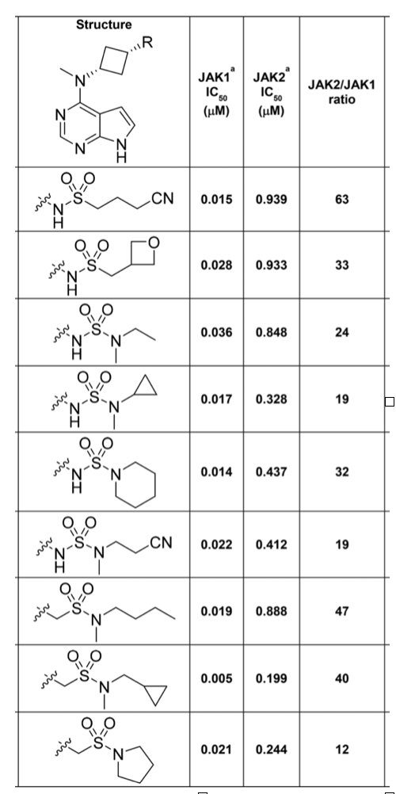

# Designing selective kinase inhibitors

PostEra

## Problem context

Many diseases are caused by proteins in the body being too inactive or too active. As such, most drugs work by stopping or activating proteins. Here we will focus on stopping proteins (so-called inhibitors). 

The way proteins work is akin to a key opening a lock - a protein can be thought of as a large object with a small keyhole. The goal of a medicinal chemist is to find a molecule - a key - that can slot perfectly into the keyhole. 

However, biology doesn't like medicinal chemists. Many proteins share similar "keyholes". A key that switches off a desired protein could also switch off other similar proteins. Whilst shutting down the disease-causing protein is good, shutting down other essential proteins is bad. That's why drugs have side-effects. 

In the drug discovery process, medicinal chemists will typically want to design molecules that are "selective" - i.e. it only interacts with the targeted protein and nothing else. This is challenging because it is hard to know, by eye, what are the molecular features that cause binding to one protein, but not other very similar proteins. 

That's where machine learning becomes useful! 

If we can build models that predict the ability of a molecule to stop different proteins, we can design molecules that can selectively stop the target protein but not others. 

In this problem, we will focus on the JAK (Janus-associated kinase) family of proteins. This family has 4 similar proteins: JAK1, JAK2, JAK3 and TYK2. The JAK family is strongly associated with diseases such as cancer and inflammation. 

There are already several approved JAK inhibitors to treat human diseases, including tofacitinib (an unselective JAK inhibitor from Pfizer) for rheumatoid arthritis, ruxolitinib (a selective JAK1/2 inhibitor from Incyte) for intermediate- or high-risk myeloproliferative neoplasms, baricitinib (a selective JAK1/2 inhibitor) for the treatment of rheumatoid arthritis, and peficitinib (an unselective JAK inhibitor) approved in Japan for treatment of rheumatoid arthritis. However, there is a strong hypothesis that the side-effects of these drugs are caused by hitting JAK2 as collateral damage. Designing selective JAK inhibitors has been a major focus in the pharma industry. 

For example, here’s a recent table from a paper from Pfizer summarizing medicinal chemists’ progress in finding selective inhibitor against JAK1 (full text of paper available [here](https://www.osti.gov/biblio/1526050); don’t worry about reading it unless you are interested). IC50 is the concentration of compound required to shut down 50% of protein function. As such, a lower IC50 implies a more potent compound. This table shows that the chemists have found a compound that is 63x more potent against JAK1 than JAK2. That’s great, except it was a long process of trial-and-error. PostEra’s mission is to make drug discovery faster.

In this problem, you are given a dataset of measured activity against 4 related proteins: JAK1, JAK2, JAK3 and TYK2. There are two related types of measurements: pIC50 and pKi – in both cases, a higher number suggest stronger binding. 

**The goal is to develop a model that can predict the pKi of a given compound against JAK1, JAK2, JAK3 and TYK2.**

## Data

The Jupyter notebook will show you how to manipulate the data. 

## Problem statement

Please implement a deep learning model on text or graphs that predicts pKi as a function of molecular structure. For text-based models, a tokenizer is provided in the notebook.

**Please code this model yourself in the machine learning framework of your choice. Please don't clone an existing ML-for-chemistry model implementation.**

Please create a private repository that you share with us for submitting your solution.

No need to go crazy! We're interested in how you think about model building and evaluation, not in having you reach SOTA performance. Plus there's not that much data, and you may not have a GPU.
